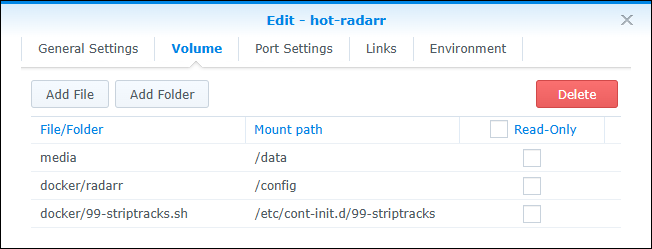

# About
This mod can now be used with [hotio](https://hotio.dev/) containers by using the method described in the hotio [FAQ](https://hotio.dev/faq/#:~:text=I%20would%20like%20to%20execute%20my%20own%20scripts%20on%20startup%2C%20how%20would%20I%20do%20this%3F) to install it.
(This method relies on s6-overlay v2 behavior still working, though v3 is the current version.)

> [!NOTE]
> This is a quick and dirty script with minimal testing or error checking.  Note that it only runs *inside* the hotio container and should **not** be executed manually.

# Installation
1. Download the **[99-striptracks.sh](99-striptracks.sh)** install script and save it somewhere that can be mounted by your container.  

    *Example location:*  `/volume1/docker/99-striptracks.sh`  

    *Example curl line to download the installation script:*  

    ```shell
    curl -s https://raw.githubusercontent.com/TheCaptain989/radarr-striptracks/master/hotio/99-striptracks.sh >/volume1/docker/99-striptracks.sh
    ```

2. Make it executable:

    ```shell
    chmod +x /volume1/docker/99-striptracks.sh
    ```

3. Configure your selected Docker container with all the port, volume, and environment settings from the *original container documentation* here:  
   **[hotio/radarr](https://hotio.dev/containers/radarr/ "Radarr Docker container")**  OR  **[hotio/sonarr](https://hotio.dev/containers/sonarr/ "Sonarr Docker container")**

> [!IMPORTANT]
> Notice that the DOCKER_MODS environment variable is ***not*** used in this setup.  That is a specific feature of LSIO containers and is not applicable to hotio containers.

4. Add the **99-striptracks.sh** file path as a mount point in your `compose.yml` file or `docker run` command.  

> [!WARNING]
> The `/etc/cont-init.d/99-striptracks` path in the `volumes` section below is important; don't change it!

   *Example Docker Compose YAML Configuration*

   ```yaml
   services:
   sonarr:
       container_name: sonarr
       image: ghcr.io/hotio/sonarr
       ports:
       - "8989:8989"
       environment:
       - PUID=1000
       - PGID=1000
       - UMASK=002
       - TZ=Etc/UTC
       volumes:
       - /<host_folder_config>:/config
       - /<host_folder_data>:/data
       - /volume1/docker/99-striptracks.sh:/etc/cont-init.d/99-striptracks
   ```  

   <details>
   <summary>Example Docker Run Command</summary>

   ```shell
   docker run --rm \
       --name sonarr \
       -p 8989:8989 \
       -e PUID=1000 \
       -e PGID=1000 \
       -e UMASK=002 \
       -e TZ="Etc/UTC" \
       -v /<host_folder_config>:/config \
       -v /<host_folder_data>:/data \
       -v /volume1/docker/99-striptracks.sh:/etc/cont-init.d/99-striptracks \
       ghcr.io/hotio/sonarr
   ```  

   </details>
   <details>
   <summary>Synology Screenshot</summary>
  
   *Example Synology Configuration*  
   

   </details>

> [!CAUTION]
> Please be sure that your mount points for `/config` and `/data` above do not overlap with the newly added mount point!

5. Start the container.

6. After the container has fully started, continue with Installation step 2 in the main [Readme](../#installation) to configure `striptracks.sh` as a custom script from Radarr's or Sonarr's *Settings* > *Connect* screen.

# Requirements
You must have the **bash** shell available in your host path.  You *might* attempt editing the [shebang](https://en.wikipedia.org/wiki/Shebang_(Unix)) in the `99-striptracks.sh` script to get around this, but that is beyond the scope of this document.

# Known Issues
On at least *some* Synology hosts that use the ash shell, this script will cause the container to abort and not start.  If this happens, ***check your container logs*** for hints as to what may be wrong.
