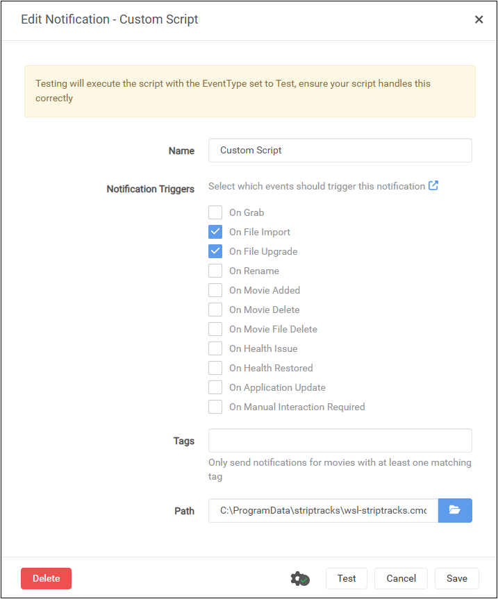

# About
This mod is able to run on Windows versions of Radarr and Sonarr by using the [Windows Subsystem for Linux (WSL)](https://learn.microsoft.com/en-us/windows/wsl/).

# Installation
Below are highly simplified installation instructions assuming defaults on a basic system.  Your specific system may require changing paths or other wrapper script alterations.

1. Install Radarr or Sonarr on Windows
2. Install WSL from PowerShell:

    ```powershell
    wsl --install
    ```

3. Run the [wsl-install-striptracks.ps1](./wsl-install-striptracks.ps1)
installation script, entering your Linux user password when prompted:

    ```powershell
    iex (iwr "https://raw.githubusercontent.com/TheCaptain989/radarr-striptracks/refs/heads/master/wsl/wsl-install-striptracks.ps1").Content
    ```

    >![notes] The password entered here is *only* used to execute sudo once to install required Linux packages.  It is not stored or saved anywhere.

    The installation script supports optional command-line arguments to change the default branch, installation directory, etc.

    <details>
    <summary>Command-Line Arguments</summary>

    Option|Argument|Description
    ---|---|---
    -Password|\<SecureString>|Your WSL Linux user password
    -Directory|\<path>|Directory to install striptracks to<br/>Default: `C:\ProgramData\striptracks`
    -Branch|\<string>|GitHub branch of source code to download<br/>Default: `master`
    -Webroot|\<url>|GitHub download URL for striptracks<br/>Default: `https://raw.githubusercontent.com/TheCaptain989/radarr-striptracks/refs/heads/master`
    
    </details>

4. Configure a custom script from Radarr's or Sonarr's *Settings* > *Connect* screen and type the following in the **Path** field:  
   `C:\ProgramData\striptracks\wsl-striptracks.cmd`  

   

## Explanation
WSL provides a way to run a virtual Linux machine on Windows.  The script and supporting MKVToolNix package are running in the virtual machine
and WSL makes the magic possible to have them interoperate.

## Requirements
- This requires WSL v2.
- This has only been tested on Windows 11 23H2.
- Only one instance each of Radarr and Sonarr are supported.
- The Radarr/Sonarr configurations must be stored under the `%ProgramData%` directory (by default, these are C:\ProgramData\Radarr or C:\ProgramData\Sonarr).

[notes]: ../.assets/notes.png "Note"
